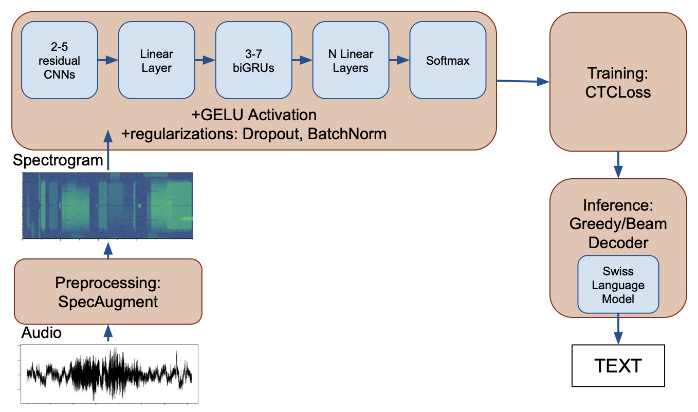

# SG-StartHack-ASR
Voice Assistant based on Speech Recognition From Swiss German and High German
Note: this repository will be private after the competition, since we want to commercialize it.

## Use of Swiss German Voice Assistant

To check Voice-Chat in Telegram reach the Telegram-bot = @SwissGerman (not on the server, you will need to contact us to put it on OR you can test it yourself.
You will need to send a voice message with the question to Canton of Sankt Gallen, the reply will be a text message with redirection to responsible authorities on your topic (e.g. taxes, migration office).

## Installation of Telegram-bot

To check the decoding for Telegram-bot you should run the file main.py, it is important to keep files beam_search_decoder_ASR_telegram.py, new-swiss_kenlm.bin, lexicon-2.txt in the same directory. But you also need to have your own TOKEN for the bot and contact us for the config.py.

## Use of High German Assistant

## Files description
1. Substitution of numbers in text; spell_numbers_in_german.ipynb
2. Main jupyter notebook with both data preparation and model training; audio_model_training_sg.ipynb
3. Building and integration of KenLM Language Model; kenlm-swiss-german.ipynb
4. Testing the sample audio data code; beam_search_decoder_ASR_telegram.py
5. Integration with decoding TelegramBot: main.py
6. Different .csv files with mapping filename.wav-utterance: bern.csv - 40k audios from corpus of Bern Parliament, swiss_sg.csv - 500 audios (own recorded) on SG call center topics
7. Files with SG call center transcription: SG_1-4.xlsx
8. Swiss German vocabulary, based on text data, needed for ctc decoder: lexicon-2.txt
9. KenLm Swiss German Language Model, based on text data (not included on github): new_swiss_kenlm.bin
11. Best ASR model from Swiss Speech to text (not included on github): model-v2.pt
12. Keyword extraction
13. Not included on github: 40k .flac and .wav audio files, located on the private google drive

## ASR Swiss Speech Model View
WER = 30% on test: of the best model for the SPECIFIC goverment-related topics
CER = 13% on test: of the best model for the SPECIFIC goverment-related topics

model(c) Iana Mikhailova
